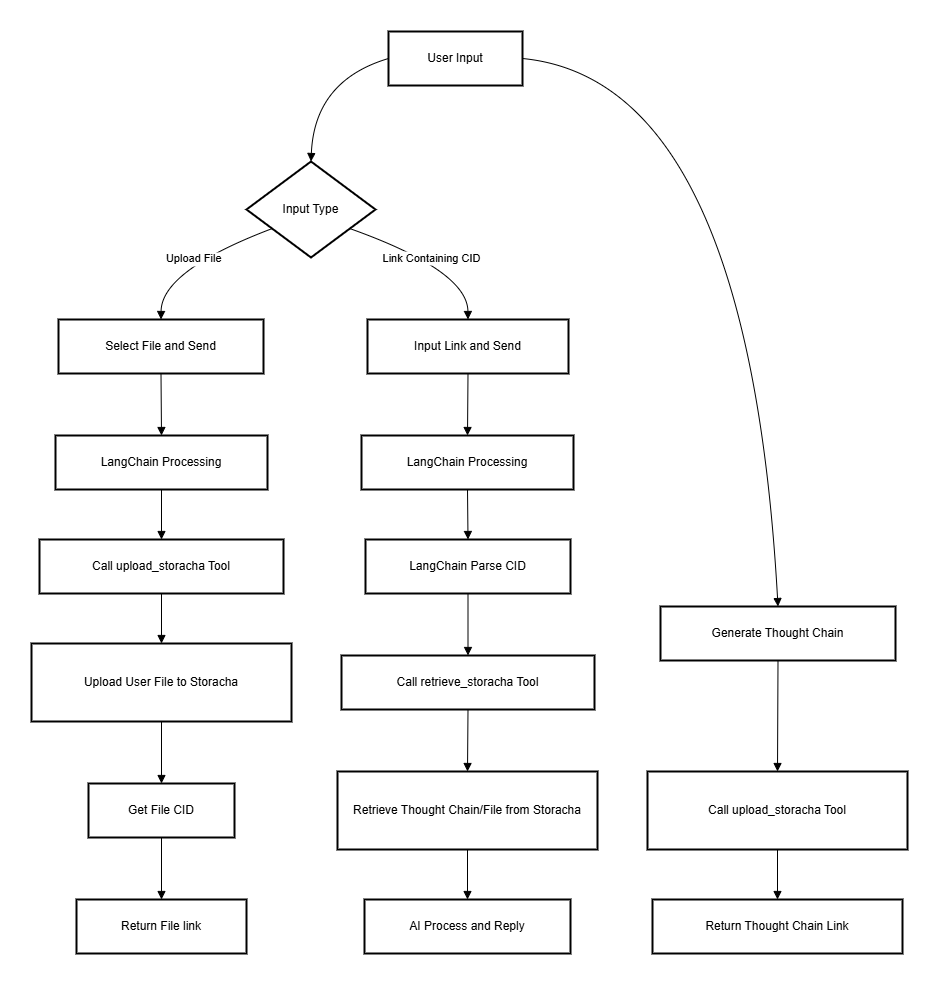

# LangChain Storacha Tool
A tool providing distributed storage functionality for LangChain.


## Description
The LangChain Storacha tool enables agents to interact with decentralized storage network, allowing for file uploads and retrieval.

- LangChain is an open-source framework designed to simplify the development of applications powered by large language models (LLMs). It provides modular tools to integrate LLMs (like OpenAI, Anthropic, Hugging Face) with external data, APIs, and workflows, enabling developers to build context-aware, data-driven AI systems.


- Storacha is a decentralized storage. It's the ultimate scaling solution for IPFS, adding the perfect kick to storage and retrieval, built on top of Filecoin. Plus, it guarantees verifiable, user-owned data. Whether you’re scaling decentralized applications or infrastructure, Storacha delivers unmatched performance and reliability.


## ✨ Features

- **Chat-style interface** for intuitive interactions
- **File uploads** with preview capabilities
- **Thought chain uploads** Storage the thought chain everytime you ask the AI
- **File retrieval** Retrieve file or thought chain by link or cid
- **Smart content display**:
    - 📷 Image previews
    - 📝 Text/JSON rendering
    - ⬇️ Download links for other files
- **Dark mode** optimized interface

## Configuration

1. Create the env var file
    ```bash
    Copy .env.example to .env and fill in the appropriate values.
    ```

2. Install the @web3-storage/w3cli package
    ```bash
    pnpm install -g @web3-storage/w3cli
    ```

3. Generate and set the Agent Private Key
   ```bash
   w3 key create
   ```
   - Copy the private key (e.g., `MgCbWL...6wFKE=`) and set it to the `VITE_STORACHA_AGENT_PRIVATE_KEY` env var.
   - Copy the Agent DID key (e.g., `did:key:...`) to create the Agent Delegation.

4. Create the Agent Delegation
   - create `proof.car` with the DID Key you copied in the previous step and execute:
   ```bash
   w3 delegation create AGENT_DID_KEY \
    --can 'store/add' \
    --can 'filecoin/offer' \
    --can 'upload/add' \
    --can 'space/blob/add' \
    --can 'space/index/add' > proof.car
   ```
   

## Workflow


## Start Demo
1. Build and start the agent from the project root folder
    ```bash
    pnpm i
    pnpm dev
    ```

2. Open http://localhost:5173 in browser and have fun

## Features

### 1. File Upload

- STORAGE_UPLOAD action for uploading files and thoughts to the Storacha network
- Supports multiple file types and sizes
- Provides a link to access uploaded files

### 2. File Retrieval

- STORAGE_RETRIEVE action for reading files and upload thought chain from the IPFS based on a CID.

## Development

1. Clone the repository

2. Install dependencies

## License

MIT & Apache 2
