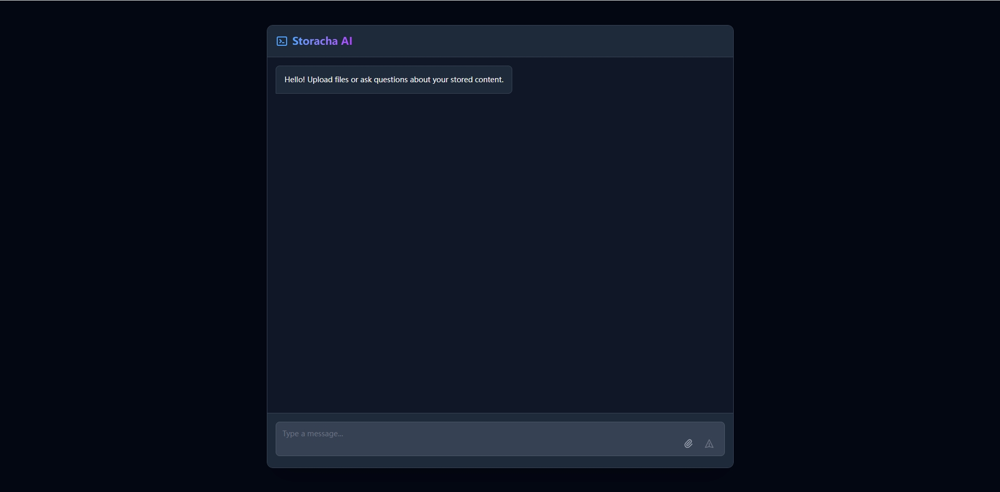

# Storacha AI - IPFS Chat Interface



## Description

A conversational UI for interacting with IPFS storage, featuring file uploads and natural language search.

## ✨ Features

- **Chat-style interface** for intuitive interactions
- **File uploads** with preview capabilities
- **Natural language search** across stored content
- **Smart content display**:
    - 📷 Image previews
    - 📝 Text/JSON rendering
    - ⬇️ Download links for other files
- **Dark mode** optimized interface

## Configuration

1. Create the env var file
    ```bash
    Copy .env.example to .env and fill in the appropriate values.
    ```

2. Generate and set the Agent Private Key
   ```bash
   w3 key create
   ```
   - Copy the private key (e.g., `MgCbWL...6wFKE=`) and set it to the `VITE_STORACHA_AGENT_PRIVATE_KEY` env var.
   - Copy the Agent DID key (e.g., `did:key:...`) to create the Agent Delegation.


3. Create the Agent Delegation
   - create `proof.car` with the DID Key you copied in the previous step and execute:
   ```bash
   w3 delegation create AGENT_DID_KEY \
    --can 'store/add' \
    --can 'filecoin/offer' \
    --can 'upload/add' \
    --can 'space/blob/add' \
    --can 'space/index/add' > proof.car
   ```

## Start Demo
1. Build and start the agent from the project root folder
    ```bash
    pnpm i
    pnpm dev
    ```

2. Open http://localhost:5173 in browser and have fun

## Features

### 1. File Upload

- STORAGE_UPLOAD action for uploading files and thoughts to the Storacha network
- Supports multiple file types and sizes
- Provides a link to access uploaded files

### 2. File Retrieval

- STORAGE_RETRIEVE action for reading files and upload thoughts from the IPFS based on a CID.

## Development

1. Clone the repository

2. Install dependencies

## License

MIT & Apache 2
